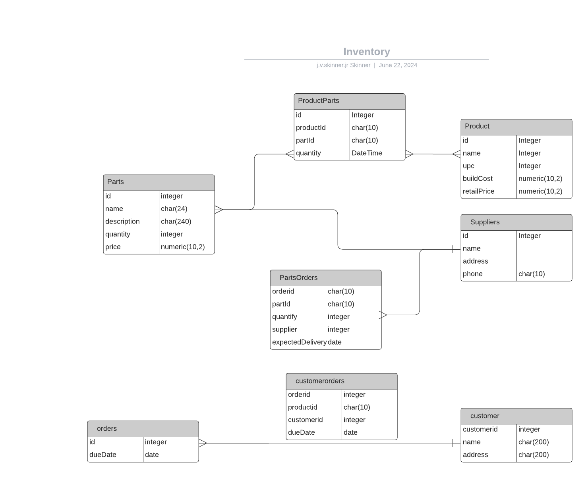

# Inventory Database Model
This is a simple sql structure for an inventory database.
The project goal is to implement a basic inventory database with PostgreSQL and the store, and 
Vue as the front-end for basic data entry and queries.

# inventory
## PARTS
| id | supplier | name          | description       | quantity | price |
|---:|---------:|:--------------|:------------------|---------:|------:|
|  1 |        1 | chip1         | a chip            |      200 |  2.95 |
|  2 |        2 | connector     | edge connector    |        1 |  3.45 |
|  3 |        2 | fan           | cooling fan       |       30 |  4.50 |
|  4 |        1 | 8 mm screw    | 8 mm screw        |      200 |   .08 |
|  5 |        1 | 1000 resister | 1000 ohm resister |      140 |  0.02 |

## Product
| id | name   | upc | buildCost | retailPrice | 
|---:|:-------|----:|----------:|------------:|
|  1 | board1 | 123 |     50.00 |       80.00 |
|  2 | board2 | 124 |     20.00 |       25.30 |
|  3 | board3 | 567 |      1.35 |        2.50 |

## ProductParts
| productId | partId | quantity |
|----------:|-------:|---------:|
|         1 |      1 |        1 |
|         1 |      2 |       20 |
|         1 |      3 |        1 |

##

## Suppliers
| id | name    | address                                   | phone      |
|---:|:--------|:------------------------------------------|:-----------|
|  1 | Digikey | 101 1st ave, New York, New Work,NY, 12345 | 1234567890 |
|  2 | Jameco  | 303 main st, Cleveland, OH 23456          | 0987654321 |

## PartsOrders

| id | partId | quantity | supplier | expectedDelivery |
|---:|-------:|---------:|---------:|:-----------------|
|  1 |      5 |      100 |        1 | 6/21/2025        |
|  2 |      3 |        5 |        2 | 7/25/2025        |

## customer

|  id | name                  | address                                   |
|----:|:----------------------|:------------------------------------------|
|   1 | harris corp           | 1 main st, knoxville, tn, 12345           |
|   2 | Jim Smith             | 202 washington Ave, Minneapolis, MN 55110 |
|   3 | Blue Fish Industries  | 605 Atlantic Ave, Fishingtown, ME 010101  |

## customerOrders

|  id |  customerId |  orderId |
|----:|------------:|---------:|
|   1 |           1 |        1 |
|   2 |           2 |        1 |
|   3 |           1 |        2 |

## Orders

| id |  customerId | dueDate    | Status     | shipmentDate  |
|---:|------------:|:-----------|:-----------|:--------------|
|  1 |           1 | 8/15/2024  | pending    |               |  
|  2 |           2 | 10/25/2024 | completed  | 5/15/2024     |

## Sample Queries
What parts are needed to build the products in order 1?

What should we order to have enough in stock to build X product items of type/id Y?

What is the customer cost for order X?

# Code
## initDb.js
The initDB.js initializes the `InventoryDB` database to an empty database with no tables defined.
## pgLoadDb.js
pgLoadDb.js creates the table definitions and performs a population with the sample data shown 
in this README file.
## pgQuery
This file runs a 'select' statement: SELECT id,name,price FROM Parts WHERE price < 20.

