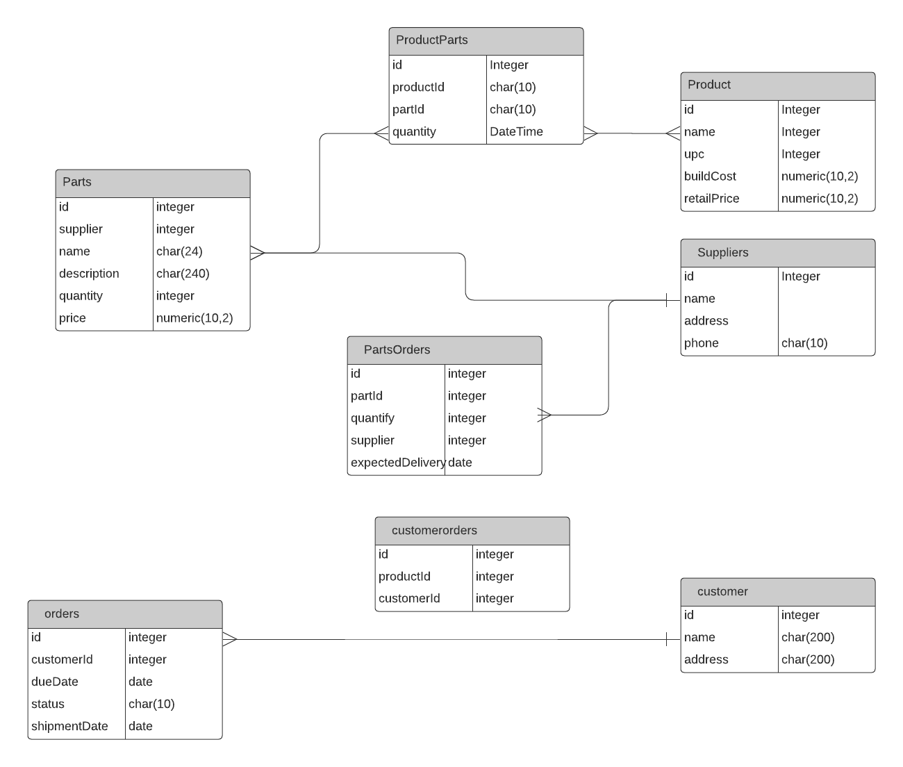

# inventory
## PARTS
| id | supplier | name | description | quantity | price |
| ---:|---:|:------- |:------------- | ----:| ------:|
| 1 | 1 | chip1 | a chip | 200 | 2.95 |
| 2 | 2|  connector | edge connector |  1 | 3.45 |
| 3 | 2 | fan | cooling fan | 30| 4.50 |

## Product
| id | name | upc | buildCost | retailPrice | 
|---:|:------------------ |---:|---:|---:|
|1|board1|123|50.00|80.00|
|2|board2|124|20.00|25.30|
|3|board3|567|1.35|2.50|

## ProductParts
|productId | partId | quantity |
|---:|---:|-----:|
|1|1|1|
|1|2|20|
|1|3|1|

## Suppliers
| id | name | address | phone |
| ---:|:------------|:------------------------------------- |:------------|
|1|Digikey | 101 1st ave, New York, New Work,NY, 12345|1234567890|
|2|Jameco | 303 main st, Cleveland, OH 23456|0987654321|

